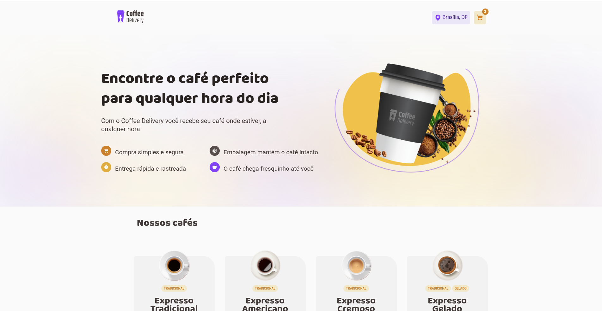
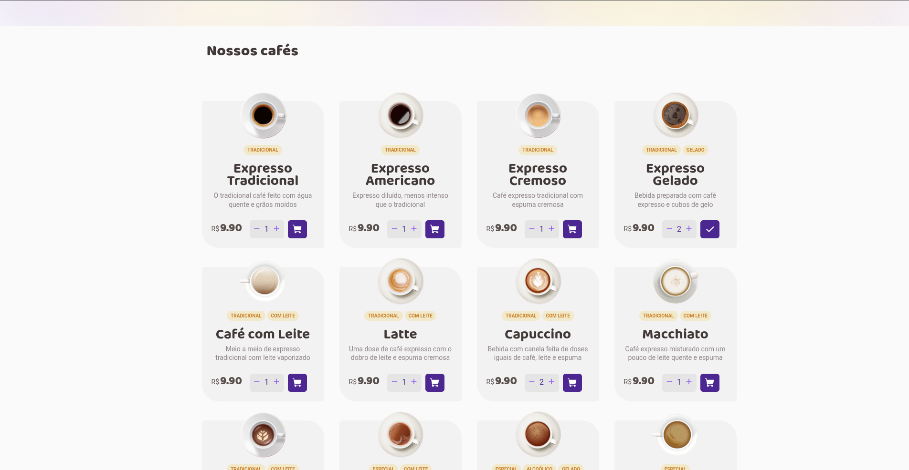
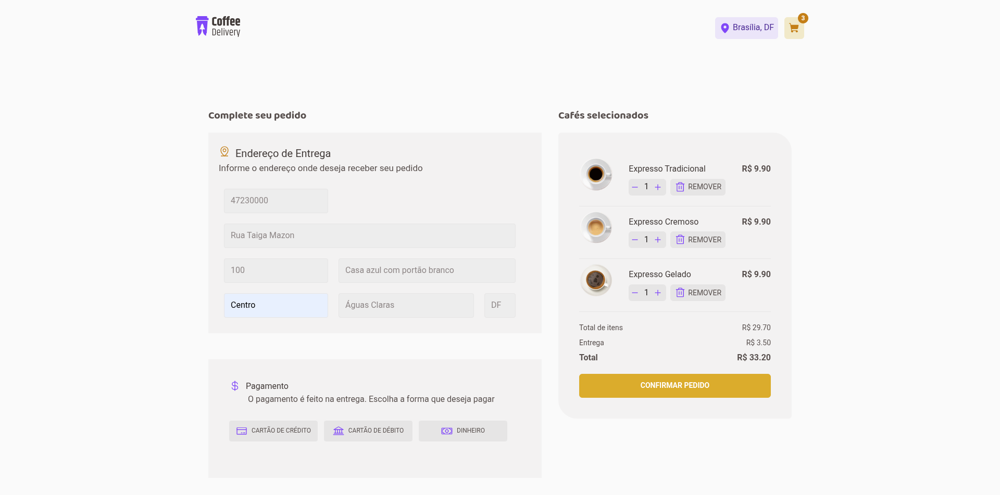
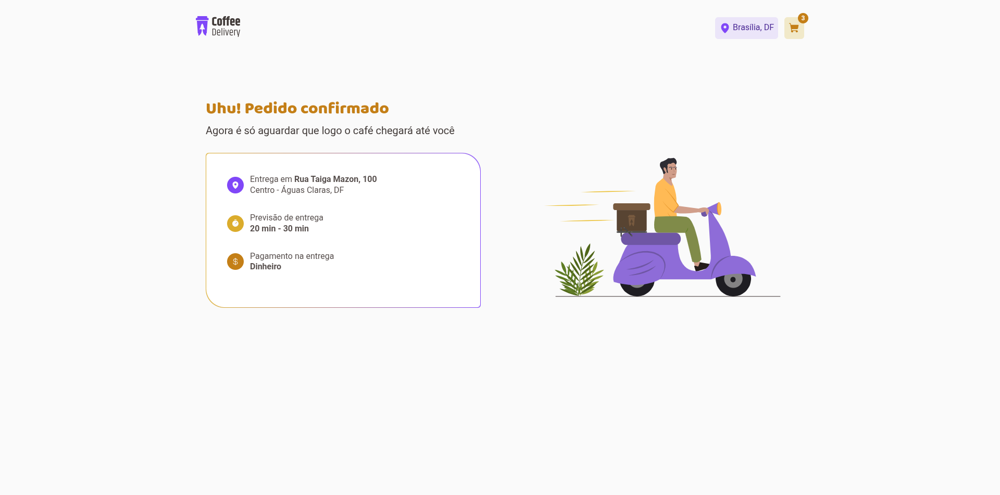

# Coffee Delivery

## Este é um projeto de delivery de cafés desenvolvido como desafio prático para reforçar conceitos do ReactJS. Nele é possível acessar uma lista de cafés disponíveis e selecionar a quantidade que desejar dentre as opções e adicioná-los ao carrinho. Para concluir a compra basta adicionar o endereço de entrega (Os inputs possuem validaçõe) e modo de pagamento. 

    
    
    
    

# Funcionalidades

- Listagem de produtos (cafés) disponíveis para compra

- Adicionar uma quantidade específicas de itens no carrinho

- Aumentar ou remover a quantidade de itens no carrinho

- Formulário para o usuário preencher o seu endereço

- Exibir o total de itens no carrinho no Header

- Exibir o valor total da soma de itens no carrinho multiplicados pelo valor

# Conceitos abordados

- Estados

- ContextAPI

- LocalStorage

- TypeScript - Para lógica de programação e tipagem 

- Imutabilidade do estado

- Listas e chaves no ReactJS

- Propriedades

- Componentização

- Styled Components - Para estilização da interface

# Como utilizar

1- Clone o projeto
`git@github.com:helen-andrade/coffee-delivery.git`

2- Instale as dependências
`npm i`

3- Rode o script de desenvolvimento
`npm run dev`

---

    
Feito com ♡ por Helen Andrade

